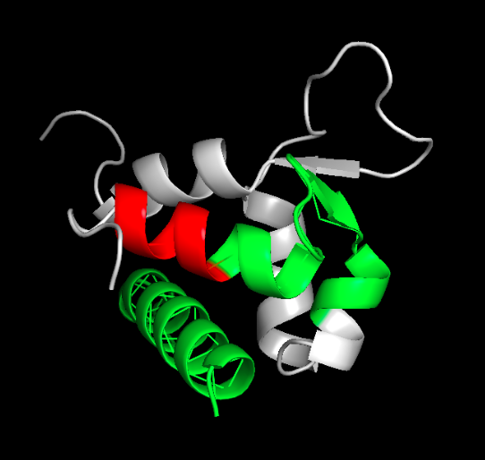

# Identification of LIPs in PDB structures

Project report for the Structural Bioinformatics course AY 2018/2019. The assignment requires to identify Linear Interacting Peptides (LIPs) in PDB structures.

## **Table of contents**
<!-- TOC depthFrom:1 depthTo:4 withLinks:1 updateOnSave:1 orderedList:0 -->

- [Identification of LIPs in PDB structures](#identification-of-lips-in-pdb-structures)
	- [**Table of contents**](#table-of-contents)
	- [**Introduction**](#introduction)
		- [Group members references](#group-members-references)
		- [Software requirements](#software-requirements)
		- [Software retrieval](#software-retrieval)
		- [Execution log](#execution-log)
	- [**General description of the software**](#general-description-of-the-software)
		- [Dataset description](#dataset-description)
			- [Unique identification of the residue](#unique-identification-of-the-residue)
			- [Features](#features)
			- [Label](#label)
		- [Models](#models)
			- [Random forest](#random-forest)
			- [SVM](#svm)
			- [Logistic Regression](#logistic-regression)
		- [Learning pipeline](#learning-pipeline)
			- [Preprocessing](#preprocessing)
			- [Balancing](#balancing)
			- [Features selection](#features-selection)
			- [Metrics](#metrics)
	- [**Configuration**](#configuration)
		- [Working environment configuration](#working-environment-configuration)
		- [Parameters configuration](#parameters-configuration)
			- [Dataset](#dataset)
			- [Data processing](#data-processing)
			- [Session](#session)
			- [Random forest](#random-forest)
			- [Other models](#other-models)
	- [**User guide**](#user-guide)
		- [Generating the dataset](#generating-the-dataset)
			- [Working with RING](#working-with-ring)
		- [Retraining the models](#retraining-the-models)
		- [Predicting](#predicting)
			- [Input examples](#input-examples)
			- [Output example](#output-example)
	- [**Description of the implementation**](#description-of-the-implementation)
		- [Dataset](#dataset)
			- [Generation](#generation)
			- [Public methods description](#public-methods-description)
		- [Preprocessing](#preprocessing)
			- [Public methods description](#public-methods-description)
		- [Features](#features)
			- [Biopython features](#biopython-features)
			- [RING features](#ring-features)
			- [Custom features](#custom-features)
		- [Features selection](#features-selection)
			- [Public methods description](#public-methods-description)
		- [Model (predictor)](#model-predictor)
			- [EnsembleVotingPredictor](#ensemblevotingpredictor)
			- [Public methods description](#public-methods-description)
		- [Input example](#input-example)
			- [Public methods description](#public-methods-description)
	- [**Observations and results**](#observations-and-results)

<!-- /TOC -->

## **Introduction**

### Group members references

The hereby described software has been developed by (in alphabetical order):

| **Student**        | **ID**  |
| ------------------ | ------- |
| Del Conte Alessio  | 1189941 |
| Rizzo Matteo       | 1206694 |
| Zangari Alessandro | 1207247 |

### Software requirements

The LIPs predictor has been developed and tested using  [Python 3.6](https://www.python.org/downloads/release/python-360/) and it is not totally backward compatible with Python 2.X.

The packages to be installed in order for the LIPs predictor to run properly are listed in the following table. Note that the same requirements are listed in the ```requirements.txt``` file in the root folder of the repository as well, and can be installed in one step using [pip3](<https://pypi.org/project/pip/>) or PyCharm.

| **Package** | **Reference**                                   |
| ----------- | ----------------------------------------------- |
| numpy       | <https://www.numpy.org/>                        |
| pandas      | <https://pandas.pydata.org/>                    |
| biopython   | <https://biopython.org/>                        |
| matplotlib  | <https://matplotlib.org/>                       |
| requests    | <https://2.python-requests.org/en/master/>      |
| sklearn     | <https://scikit-learn.org/stable/>              |
| typing      | <https://docs.python.org/3/library/typing.html> |
| tabulate    | <https://pypi.org/project/tabulate/>            |
| joblib      | <https://joblib.readthedocs.io/en/latest/>      |

Furthermore, the LIPs predictor makes use of two main external libraries:

- **RING**: the Residue Interaction Network Generator (RING), identifies all types of non-covalent interactions at atomic level in a protein structure (PDB);
- **DSSP**: a database of secondary structure assignments.

In order to be able to regenerate the dataset you need to satisfy their requirements as well. Note however that a copy of both the executables of the libraries are available at ```/libraries```.

Please refer to the official documentation to install the libraries and/or their requirements:

- **RING** official documentation is available at <http://protein.bio.unipd.it/ring/>;
- **DSSP** official documentation is available at <https://swift.cmbi.umcn.nl/gv/dssp/DSSP_1.html>.

### Software retrieval

The LIPs predictor is available as a Github repository at the following url:

<https://github.com/MatteoRizzo96/LIPsPredictor>.

### Execution log

The execution is extensively logged in a ```app.log``` file in the root folder of the project. The utility used for logging is the Python library called [logging](https://docs.python.org/2/library/logging.html).

## **General description of the software**

### Dataset description

The dataset is stored in ```/dataset/dataset.csv``` and is conceptually divided in three main sections by columns.

#### Unique identification of the residue

| Name             | **Type** | **Description**                                              |
| ---------------- | -------- | ------------------------------------------------------------ |
| ```pdb_id```     | String   | The identification code of the protein in the PDB, which the residue belongs to. |
| ```chain```      | String   | The chain which the residue belongs to inside the protein.   |
| ```res_seq_id``` | Integer  | The identification number of the residue in the chain.       |

#### Features

| **Name**                    | **Type** | **Description**                                              |
| --------------------------- | -------- | ------------------------------------------------------------ |
| ```HSE_up```                | Float    | Half Sphere Exposure (HSE) up.                               |
| ```HSE_down```              | Float    | Half Sphere Exposure (HSE) down.                             |
| ```ASA```                   | Float    | Accessible Surface Area (ASA).                               |
| ```sec_struct```            | Float    | Secondary structure presence.                                |
| ```contacts_ratio```        | Float    | Contacts ratio: inter chain divided by intra chain contacts (+1). |
| ```contacts_energy_ratio``` | Float    | Contacts ratio calculated with the energy of the bond: sum of inter chain energy bonds divided by intra chain energy bonds (+1). |
| ```distance_from_line```    | Float    | Distance from a line conjuncting the first and the last residue of a part of the chain multiplied by window of increasing length. This window is increased only if the last residue is not too far from the line drawn without it. |
| ```structural_linearity```  | Float    | Ratio of contacts computed with the formula: <br />inter_sc / (intra + intra_long * 4) . |

#### Label

| Name         | **Type** | **Description**                                              |
| ------------ | -------- | ------------------------------------------------------------ |
| ```is_lip``` | Float    | Label indicating if the residue is or is note a Linear Interacting Peptide (LIP). |

### Models

To obtain a solid prediction model, we trained three different models and then ensembled them to make a prediction. Below is provided a brief description of each model adopted.

We also detected that SVM and Logistic Regression weren't able to achieve high scores during evaluation, and that Random Forest alone was actually better than the combined model. Unlike the other two, random forest is a method of ensemble learning, and allows to get reasonably good predictions, while SVM and Logistic Regression can sometimes perform worse.

It's possible to configure the model and combine more than one predictor by setting the correct parameters in the `.json` file as described in section [Session](#session).

#### Random forest

Random Forests (RF) or Random Decision Forests (RDF) are an ensemble learning method for classification, regression and other tasks that operates by constructing a multitude of decision trees at training time and outputting the class that is the mode of the classes (classification) or mean prediction (regression) of the individual trees. Random decision forests correct for decision trees' habit of overfitting to their training set.

#### SVM

A Support Vector Machine (SVM) is a discriminative classifier formally defined by a separating hyperplane. In other words, given labeled training data (supervised learning), the algorithm outputs tries to find the optimal hyperplane which is able to separate the negative from the positive example. Using different hyperparameters it is possible to control how much the classifier will tolerate examples falling in the wrong side of the separating hyperplane, which allows to control overfitting.

#### Logistic Regression

Logistic regression is an algorithm used in the task of regression, which is the prediction of a target numeric value, given a set of features. Sometimes, the regression task can be used for classification purposes, for example computing the expected probability of an example to belong to each class, which is our case.

### Learning pipeline

#### Preprocessing

The LIPs predictor preprocesses both the dataset and the input example by:

1. Filling missing values with the median of the feature;
2. Scaling the features in range [0,1];
3. Applying a sliding window of configurable width.

#### Balancing

The dataset is balanced with respect to the relative percentage of positive and negative examples, based on the ```balance_ratio``` configurable parameter. Note that this operation may reduce the overall size of the dataset, since the balancing function outputs the greatest subset of the dataset that respects the ```balance_ratio```. Note that the basic dataset (before being balanced) has a positive examples percentage of 10 ca..

#### Features selection

The features are automatically analyzed and only the best ones are used for training. Note that a bar graph is plotted to visualize the relative importance of each feature, and that the number of features which can be selected is configurable via the ```num_features``` parameter.

#### Metrics

The training step of the models output the following metrics and logs them:

```json
{
 'avg_accuracy': 0.9306771688348029, // accuracy averaged with cross validation
 'avg_f1': 0.9125974294543843,			 // f-1 score
 'avg_f_beta': 0.9148813402944416,	 // f-0.7 score (precision is more important)
 'avg_precision': 0.9194812945253806,// precision
 'avg_recall': 0.9063448090868729		 // recall
}
```

## **Configuration**

### Working environment configuration

Once satisfied the requirements declared at  § "Software requirements" of this document, you are suggested to use the software importing the project in a Python IDE (such as [Pycharm](<https://www.jetbrains.com/pycharm/>)) and working with a Python 3.6 interpreter.

### Parameters configuration

In order to configure the software execution, you need to set some parameters in the ```parameters.json``` file available inside the ```/configuration``` folder in the root directory of the repository. The aforementioned ```.json``` file has the following structure:

```json
{
  "dataset": {
    "rewrite": false,
    "use_ring_api": false,
    "delete_entities": false,
    "delete_edges": false,
    "balance_ratio": 40
  },
  "data_processing": {
    "show_best_features": false,
    "num_features": 5,
    "sw_width": 3
  },
  "session": {
    "load_clf": true,
    "dump_clf": true,
    "delete_previous_input": true,
    "svm": false,
    "forest": true,
    "logistic": false
  },
  "forest": { // list of parameters for random forest
    "grid": {
      "n_estimators": [100, 500, 1000],
      "max_features": ["auto", "sqrt"],
      "bootstrap": [true, false],
      "criterion": ["gini", "entropy"],
      "max_depth": [90, 70, 10, 5, 2, "None"],
      "min_samples_leaf": [1, 2, 4, 9, 10],
      "min_samples_split": [2, 5, 10]
    },
    "params": {
      "n_estimators": 500,
      "min_samples_split": 5,
      "min_samples_leaf": 2,
      "max_features": "auto",
      "max_depth": "None",
      "criterion": "gini",
      "bootstrap": true
    },
    "k_folds": 10,
    "grid_train": false
  },
  "svm": {
    // list of parameters for SVM classfier
    ...
  },
  "logistic": {
    // list of parameters for logistic regression
    ...
  }
}
```

There are many aspects of the software which have parameters that can be configured. The following tables lists them all and give a succinct description of their usage.

#### Dataset

The dataset generation can be configured so that if the dataset is rewritten the given parameters are used. Note that if ```rewrite=False```, the other parameters will not be used since the dataset will not be regenerated.

| **Parameter**         | **Description**                                              | **Possible values**                                          |
| --------------------- | ------------------------------------------------------------ | ------------------------------------------------------------ |
| ```rewrite```         | A flag to indicate if the dataset must be regenerated at the following run. Note that the generation of the dataset takes quite a lot of time (30m ca.). | **Boolean**. If true, the dataset will be regenerated and if a previous dataset existed it will be deleted. Otherwise, the current dataset will be used. Note that if no dataset exists it will be generated even if ```rewrite=False ```. |
| ```use_ring_api```    | A flag to decide if running RING via APIs or via executable. Note that a copy of the executable is stored at ```/libraries/ring```, which works only on Linux (tested on Ubuntu 18.04). | **Boolean**. If true, the RING APIs will be used, else the RING executable stored at ```/libraries/ring``` will be used. |
| ```delete_entities``` | A flag to indicate if the RING entities files must deleted when rewriting the dataset. | **Boolean**. If true, the content of the dataset/entities folder will be deleted before rewriting the dataset, else the content of the dataset/entities folder will not be deleted before rewriting the dataset. |
| ```delete_edges```    | A flag to indicate if the RING edges files must deleted when rewriting the dataset. | **Boolean**. If true, the content of the dataset/edges folder will be deleted before rewriting the dataset, else the content of the dataset/edges folder will not be deleted before rewriting the dataset. |
| ```balance_ratio```   | A value denoting the desired percentage of positive examples within the dataset. | **Positive integer**. In [0, 100].                           |

#### Data processing

This section contains basic configuration of processing on data.

| Parameter                | **Description**                                              | **Possible values**                                          |
| ------------------------ | ------------------------------------------------------------ | ------------------------------------------------------------ |
| ```show_best_features``` | A flag indicating if the bar graph of the best features according to the feature selection must be showed. | **Boolean**. If true, the bar graph will be showed, else it will not. |
| ```sw_width```           | A value denoting the left/right width of the sliding window to be applied during the preprocessing step. Note that the total width of the window is equal to 2*width+1. | **Positive integer**. In [1, num_entries/2].                 |
| ```num_features```       | The number of features to be considered in the training after the features selection. | **Positive integer**. From 1 to the max number of features in the dataset, which is 8. |

#### Session

This section contains global preferences and settings.

| **Parameter**          | **Description**                                              | **Possible values**                                          |
| ---------------------- | ------------------------------------------------------------ | ------------------------------------------------------------ |
| ```dump_clf```         | A flag indicating whether to save (dump) the classifier to a file after training. | **Boolean**. If true, when trained the classifier will be saved to file. If one already existed, it will be rewritten. |
| ```load_clf```         | A flag indicating whether to load the classifier from file instead of training a new one. | **Boolean**. If true, the program will try to find a saved model in the ```/configuration``` folder. This setting is useful in order not to have to re-train the model at each execution, which would take longer. |
| ```delete_previous ``` | A flag indicating if the data related to the previous input must be deleted or can be reused. | **Boolean**. If true, the existing data of the previous input will be deleted (this includes edges and entities files), else the existing data will be used. Note that if no previous data existed, the new input data will be calculated anyway. |
| ```svm```              | A flag indicating if the SVM model must participate to the ensemble learning. | **Boolean**. If true, the SVM will be used in the ensemble predictor, else it will not. |
| ```forest```           | A flag indicating if the Random Forest model must participate to the ensemble learning. | **Boolean**. If true, the Random Forest will be used in the ensemble predictor, else it will not. |
| ```logistic```         | A flag indicating if the Logistic Regression model must participate to the ensemble learning. | **Boolean**. If true, the Logistic Regression will be used in the ensemble predictor, else it will not. |

#### Random forest

This section contains the hyperparameters used during random forest training. To select the best hyperparameters it is possible to run a randomized grid search which will train and evaluate repeatedly each model with cross validation and select the best performing one, according to a scoring function.

| **Description**                                              | **Parameter**    | **Possible values**                                          |
| ------------------------------------------------------------ | ---------------- | ------------------------------------------------------------ |
| Different hyperparameter values to use in grid search.       | ```grid```       | **Dictionary** of hyperparameters. For a list of parameters that can be passed to SVC classifier, please refer to the [official documentation](https://scikit-learn.org/stable/modules/generated/sklearn.ensemble.RandomForestClassifier.html). |
| Hyperparameters to use with the classifier.                  | ```params```     | **Dictionary** of hyperparameters. If `grid_train=false` a classifier with this parameters will be used. |
| A boolean to indicate whether to train the classifier performing a grid search or just use the parameters in ```params```. | ```grid_train``` | **Boolean**. If *true*, a grid training will be performed, trying a random number of possible combinations of specified hyperparameters in ```grid``` section. Depending on the number of combinations the process could be quite slow. This step is not necessary since we already selected suitable parameters. If *false*: the classifier will be created using the hyperparameters specified in ```params``` section. |
| Number of folds to use in cross validation. This parameter will be used in both grid search and evaluation of the model. | ```k_fold```     | **Positive integer**.                                        |

#### Other models
Similarly to what done for Random Forest, ```svm``` section and `logistic` section of json contains the hyperparameters used to train each model. The meaning of each section is the same already described for Random Forest.

A list of hyperparameters for the SVM classifier can be found in the [official sklearn documentation](https://scikit-learn.org/stable/modules/generated/sklearn.svm.SVC.html).

A list of hyperparameters for the logistic regression can be found in the [official documentation](https://scikit-learn.org/stable/modules/generated/sklearn.linear_model.LogisticRegression.html).

## **User guide**

The following sections are dedicated to describing the main procedures the user can perform using the LIPs predictor software.

### Generating the dataset

The software is distributed together with a dataset ready to be used for predicting LIP residues given the PDB file of a protein. However, the user can regenerate the dataset as well, either if he/she wants to add a new feature or if it has been corrupted for any reason.

In order to regenerate the dataset, you simply need to set the parameter ```rewrite=True``` inside the ```parameters.json``` file inside the `configuration/` folder of the root directory. Please note that regenerating the dataset may take a quite long time (typically about 30 minutes).

#### Working with RING

While regenerating the dataset, it is possible to specify if the RING APIs or its executable must be used, via setting the flag ```use_ring_api``` in ```/configuration/parameters.json```. Note that the RING executable is stored inside ```/libraries/ring```, and it is only compatible with Linux operating systems. For more information about RING and how to get another executable please refer to its [official website](<http://protein.bio.unipd.it/ring/>). Furthermore, note that RING can also be run on a web server via APIs.

### Retraining the models

The LIPs predictor may use up to three models, all implemented via [sklearn](https://scikit-learn.org/stable/):

- A [Support Vector Machine](https://scikit-learn.org/stable/modules/generated/sklearn.svm.SVC.html) (SVM);
- A [Random Forest](https://scikit-learn.org/stable/modules/generated/sklearn.ensemble.RandomForestClassifier.html);
- A [Logistic Regression](https://scikit-learn.org/stable/modules/generated/sklearn.linear_model.LogisticRegression.html).

The predictions of each model are then combined together using ensemble learning.

In order to retrain the models, you first need to set the required parameters in the ```configuration/parameters.json``` file (please refer to [Parameters configuration](#parameters-configuration) for more information about the parameters to be configured).

As explained previously, Random Forest performed better than the other two, so we didn't use the others in order to achieve our results and we don't recommend doing so, but we left the possibility to freely select the models to be run in the session parameters.

### Predicting

In order to obtain a prediction, you are required to input a PDB identification code and a path to a DSSP executable. Note that the program takes as input a PDB file name, but the actual file is generated at run time.

Optional parameters are:

- **-configuration**: a configuration file with algorithm parameters in ```.json``` extension; defaults to `configuration/parameters.json` which is the location of our provided json file.
- **-out_dir**: the name of the output directory. Defaults to `results/`.
- **-dssp_path**: the path to dssp executable. Defaults to `libraries/xssp/mkdssp`, since we provide the executable.

Running the software will automatically output a file with name `out_pdb_name.txt` in the selected output directory.

#### Input examples

General example of working console input with default parameters:

```bash
$ python __main__.py -dssp_path libraries/xssp/mkdssp -configuration configuration/parameters.json -out_dir results 1jsu.pdb
```

Example of working input parameters with absolute path to XSSP:

```bash
-dssp_path /home/[your_name]/opt/xssp/mkdssp -configuration configuration/parameters.json 2o8a.pdb
```

Example of working input parameters with relative path to XSSP in the repository:

```bash
-dssp_path libraries/xssp/mkdssp -configuration configuration/parameters.json 2o8a.pdb
```

#### Output example

The output is generated as requested in the folder specified by the user, and saved with the name `out_pdbId.txt` with the requested format.

```txt
>1h8b
0/B/25//K 0.543 1
0/B/26//P 0.453 0
0/B/27//S 0.374 0
0/B/28//A 0.615 1
0/B/29//C 0.831 1
0/B/30//R 0.808 1
0/B/31//N 0.747 1
0/B/32//L 0.504 1
0/B/33//F 0.233 0
```

## **Description of the implementation**

### Dataset

The dataset management and I/O is mainly handled by the ```Dataset``` class stored in ```/classes/Dataset.py```. This class is used:

- To generate a dataset if the ```rewrite``` flag is true (please see § "Parameters configuration" for more information about this parameter) or if no ```dataset.csv``` file is present under the dataset folder;
- To interact with the dataset.

#### Generation

For what concerns the dataset generation, the data are written on a ```dataset.csv``` file based on the ```dataset_specifications.csv``` file. The latter contains the indication of what part of what chain of a certain protein must be considered as LIP, and what must not. The dataset generation follows this flow:

- The Dataset constructor checks if the Dataset must be rewritten or not:
  - If the dataset must not be rewritten, it just reads features and labels from the ```dataset.csv``` file;
  - If the Dataset must be written, it first of all deletes both the possibly existing ```dataset.csv``` file and the content of the edges and entities folders. Then, it iterates the ```dataset_specifications.csv``` file by rows, and for each row calculates the features of the given residues (via the private method ```__calculate_entries_data```) and writes the corresponding entries on the ```dataset.csv``` file (via the private method ```__write_entries```).

Note that the Dataset class interface with the RING library in the ```__calculate_entries_data``` method instantiating a Ring object, which is a custom that interacts with the RING executable directly (see § "Ring features" for more information about the object oriented RING interface).

#### Public methods description

##### Constructor

```python
__init__(self, dssp_path: str, rewrite: bool = True, use_ring_api=False)
```

Constructs a Dataset object.

| **Parameter**      | **Type** | **Description**                                              |
| ------------------ | -------- | ------------------------------------------------------------ |
| ```dssp_path```    | string   | The path to the DSSP library given as input to the program execution. |
| ```rewrite ```     | bool     | A flag indicating if the dataset must be rewritten or if the existing dataset must be used. |
| ```use_ring_api``` | bool     | A flag indicating if the RING library must be run via executable or via APIs. |

##### Getters

```python
get_residues_info(self) -> List[Dict]
```

Returns all the identification info of the residues in the dataset (i.e. PDB IDs, chains and sequence numbers).

```python
get_features(self) -> pd.DataFrame
```

Returns all the features within the dataset.

```python
get_features_names(self) -> List[str]
```

Returns all the the names of the features within a list.

```python
get_labels(self) -> List[float]
```

Returns all the labels within the dataset.

```python
get_dataset(self) -> pd.DataFrame
```

Returns the whole dataset (i.e. features and labels) in a DataFrame.

##### Features update

```python
update_features(self, features: pd.DataFrame)
```

Given some DataFrame of features, set this DataFrame as the new set of features.

| **Parameter**  | **Type**     | **Description**                          |
| -------------- | ------------ | ---------------------------------------- |
| ```features``` | pd.DataFrame | The new set of features for the dataset. |

##### Dataset balancing

```python
balance(self, balance_ratio: int)
```

Approximately balance the percentage of positive and negative examples based on the given balance_ratio.

| **Parameter**       | **Type** | **Description**                                              |
| ------------------- | -------- | ------------------------------------------------------------ |
| ```balance_ratio``` | int      | A desired percentage of positive examples to be achieved after the balancing. |

### Preprocessing

The class ```Preprocessor``` exposes methods to perform some basic preprocessing on a given set of data. The preprocessing pipeline is run on the main file, both on the dataset before training and on the input protein. Note that the implementation allows for a high granularity on the preprocessing of the features, since the user can specify to what features a certain preprocessing method must be applied.

#### Public methods description

##### Constructor

```python
__init__(self, features: pd.DataFrame)
```

Builds a Preprocessor utility and process missing values. More precisely, the method searches for missing or invalid values and replace them with the median of the feature.

| **Parameter**  | **Type**     | **Description**                           |
| -------------- | ------------ | ----------------------------------------- |
| ```features``` | pd.DataFrame | The whole set of features in the dataset. |

##### Getters

```python
get_features(self) -> pd.DataFrame
```

Returns the preprocessed features.

##### Features scaling

```python
apply_features_scaling(self, to_be_preprocessed: List[str])
```

Scales the features named in to_be_preprocessed in a [0,1] range.

| **Parameter**            | **Type**  | **Description**                           |
| ------------------------ | --------- | ----------------------------------------- |
| ```to_be_preprocessed``` | List[str] | The set of features (names) to be scaled. |

##### Sliding window

```python
apply_sliding_window(self, to_be_preprocessed: List[str], width: int = 3)
```

Apply a sliding window of given width to the features named in ```to_be_preprocessed```.

| **Parameter**            | **Type**  | **Description**                                              |
| ------------------------ | --------- | ------------------------------------------------------------ |
| ```to_be_preprocessed``` | List[str] | The set of features (names) to which the sliding window must be applied. |
| ```width```              | int       | The left/right width of the sliding window.                  |

### Features

Some features which are present in the dataset are calculated using specific libraries, such as:

- **DSSP**: for features related to structure and surface, and
- **RING**: for features related to contacts.

#### Biopython features

The ```Dataset``` class uses ```DSSP``` from ```Biopython``` to calculate:

- The presence of a secondary structure;
- The Accessible Surface Area (ASA).

These are given straightforward from ```DSSP``` given a certain model.

```HSExposureCB``` is instead used to calculate Half Sphere Exposure (both up and down). These features are provided straightforward from the library as well.

#### RING features

The Dataset class uses RING to calculate:

- Inter-chain contacts;
- Intra-chain contacts;
- Contacts ratio.

The interaction with the RING library is handled by multiple classes.

##### Ring

The ```Ring``` class is the main interface towards the functionalities which RING exposes. When instantiated, it initializes RING for the given protein choosing from via executable or via APIs execution. The entities and edges files which RING creates are both stored inside two folders of the same name inside the dataset directory. This class exposes a method called ```get_features``` which can be used to obtain all the features calculated with RING.

##### RingFeatures

The ```RingFeatures``` class calculates all RING-related features and exposes getter methods to fetch them.

##### RingNode

The ```RingNode``` class models a RING node initialized with a formatted node string outputted by RING.

##### RingContact

The ```RingContact``` class models a RING contact initialized with a formatted contact string outputted by RING.

#### Custom features

In addition to the features directly obtained by the above discussed libraries, three more custom features have been implemented.

##### Structural linearity

This feature is measured performing a sliding window over 11 consecutive residues and assigning to the central one the quantity `inter_sc / (intra + intra_long * 4.0)`, where `inter_sc` is the number of inter chain contacts involving at least one side chain atom of the residues, `intra` is the number of intra chain contacts and `intra_long` are the intra chain contacts with sequence separation greater than 7.

Structural linearity is a variant of contacts ratio, where long range intra contacts are more considered over standard intra chain contacts. Structural linearity is higher in residues with fewer intra chain contacts, and in particular with fewer long range contacts, since this would mean the chain is folded on itself allowing very distant residues to bind (like in &beta;-sheets).

Some references for this features are available here: <http://protein.bio.unipd.it/mobi2/>.

##### Distance from line

The idea of this feature is to determine how much a residue is positioned in a straight line with respect to the residues close to him.

To compute the feature we build a window that increases in size if adding a new residue to the window, and computing the sum of the distances between all the carbon-alpha atoms of the amino acids in the window, does not increase too much this summation with respect to the previous one. If the summation deviates too much from the previous one, the start of the window is set to the end of the previous one, and we start increasing it again until we reach the end of the chain.

At the end of this process we extrapolate for each residue the window with maximum length and multiply this length to the distance from the line for that window. In this way we also represents how big the window was (note that the larger the window was, the larger the linear section is).

##### Contacts energy ratio

This feature is the classic contact ratio feature with respect to the type of the bond and the energy that corresponds to each bond.

### Features selection

The program performs a basic features selection via the ```/classes/FeaturesSelector``` class. This class is mainly used to analyze the feature and test the model with the best features by positive correlation with the labeling.

#### Public methods description

##### Constructor

```python
__init__(self, dataset: Dataset)
```

Builds a ```FeaturesSelector``` utility.

| **Parameter** | **Type** | **Description**   |
| ------------- | -------- | ----------------- |
| ```dataset``` | Dataset  | A dataset object. |

##### Getters

```python
get_features(self) -> pd.DataFrame
```

Returns the selected features.

##### Univariate selection

```python
univariate_selection(self, num_features: int)
```

Performs a univariate selection on the features via ```sklearn.SelectKBest``` and ```chi2``` function to select the best ```num_features``` ones, where ```num_features``` is a parameter configurable in ```params.json```.

| **Parameter**      | **Type** | **Description**                        |
| ------------------ | -------- | -------------------------------------- |
| ```num_features``` | int      | The number of features to be selected. |

##### Features importances

```python
features_importance(self, num_features: int, show: bool = False)
```

Calculates the relative features importances via an in-built method of the ```sklearn.ExtraTreesClassifier``` model and plot them as a bar graph (if the ```show_best_features``` flag is true).

| **Parameter**      | **Type** | **Description**                                              |
| ------------------ | -------- | ------------------------------------------------------------ |
| ```num_features``` | int      | The number of features to be selected.                       |
| ```show```         | bool     | Indicates if the bar graph of the selected features must be displayed. |

### Ensemble voting predictor

The `EnsambleVotingPredictor` class wraps a `VotingClassifier` from [sklearn](<https://scikit-learn.org/stable/modules/generated/sklearn.ensemble.VotingClassifier.html>). It allows to add different predictors (SVM, Random Forest, Logistic regression), train and evaluate them and then re-train each of them and combine the output in a single weighed prediction. As explained the model provided and pre-trained uses only the Random Forest, so the Voting Classifier is not needed. Anyway, it's possible to use this class to add more classifiers to the ensemble model.

The classifier has different hyperparameters that must be manually set (they can’t be learned) in order to achieve good performance. These hyperparameters has been tuned using a randomized grid search, that iteratively tries different combinations of hyperparameters, and choose the best one according to the average score obtained performing a 10 fold cross validation. The scoring function we used is f-&beta;-score, computed as the harmonic mean of precision and recall, where &beta; has been set to 0.7, giving more importance to precision over recall. Using accuracy yielded worse validation results since the dataset is highly unbalanced towards negative examples.

#### Public methods description

##### Constructor

```python
__init__(self, x: Union[List[List[float]], DataFrame], y: Union[List[float], 													DataFrame], scoring_f: Union[str, Callable])
```

Builds a ```EnsembleVotingPredictor``` utility.

| **Parameter** | **Type**                                                     | **Description**                                              |
| ------------- | ------------------------------------------------------------ | ------------------------------------------------------------ |
| ```x```       | `List[List[float]] or DataFrame`                             | Examples of training set.                                    |
| `y`           | `List[float] or Dataetters	<br/><br/>1<br/>get_features(self) -> pd.DataFrame<br/>Returns the selected features.<br/><br/>Univariate selectionFrame` | Labels of training examples.                                 |
| `scoring_f`   | `str or Callable`                                            | Scoring function to use during grid search for hyperparameters and to add to evaluation metrics. |

##### Dump (save to file)

```python
dump(self)
```

This method can be called to save a trained model to file.

##### Load (load from file)

```python
load(self)
```

Load a model from file. Used to load a pre-trained model.

##### Load random forest

```python
add_random_forest(self, param: Dict)
```

Add a random forest to the model and evaluate it using model scoring function (set in constructor). `param` contains all the parameters for training and testing.

##### Load SVM

```python
add_svm(self, param: Dict)
```

Add an svm to the model and evaluate it using model scoring function (set in constructor). `param` contains all the parameters for training and testing.

##### Load logistic regression classifier

```python
add_logistic_classifier(self, param: Dict)
```

Add a logistic regression model to the voting predictor and evaluate it using model scoring function (set in constructor). `param` contains all the parameters for training and testing.

##### Fit the model

```python
fit(self)
```

Train the voting predictor with added classifier.

##### Evaluate the model

```python
evaluate(self, x_test=None, y_test=None, k_fold: int = 10) -> Dict
```

Evaluates the trained voting predictor with cross validation. It is possible to pass a test set to evaluate predictor performance. Returns a dictionary with evaluated metrics scores.

##### Predict probabilities

```python
predict_proba(self, x: List[List[float]]) -> List[List[float]]
```

Predict the class probabilities for a list of residues and return them.

### Input example

The Example class in ```classes/Example.py``` models an input example and it is used in order to extract a ```DataFrame``` of features for a given PDB id.

#### Public methods description

##### Constructor

```python
__init__(self, pdb_id: str, dssp_path: str, use_ring_api=False, delete_previous_example=False)
```

Constructs an ```Example``` object.

| **Parameter**                 | **Type** | **Description**                                              |
| ----------------------------- | -------- | ------------------------------------------------------------ |
| ```pdb_id```                  | str      | The PDB identification code of a protein.                    |
| ```dssp_path```               | string   | The path to the DSSP library given as input to the program execution. |
| ```use_ring_api```            | bool     | A flag indicating if the RING library must be run via executable or via APIs. |
| ```delete_previous_example``` | bool     | A flag indicating if the data relative to the previous example must be deleted. |

##### Getters

```python
get_features(self, best_features: List[str] = "all") -> pd.DataFrame
```

Returns all the features within the dataset that are best features (i.e. that are in best_features).

| **Parameter**       | **Type**  | **Description**                                      |
| ------------------- | --------- | ---------------------------------------------------- |
| ```best_features``` | List[str] | The features (names) to be considered best features. |

```python
get_features_names(self) -> List[str]
```

Returns all the the names of the features within a list.

```python
get_structure(self) -> Structure
```

Returns the ```DSSP``` structure of the example.

##### Update features

```python
update_features(self, features: pd.DataFrame)
```

Given some```DataFrame``` of features, set this ```DataFrame``` as the new set of features.

| **Parameter**  | **Type**     | **Description**                          |
| -------------- | ------------ | ---------------------------------------- |
| ```features``` | pd.DataFrame | The new set of features for the dataset. |

## **Observations and results**

The final tests on the models give the following values for the key metrics:

```json
{
    'avg_accuracy': 0.9336888524592505,
    'avg_f1': 0.916490279785851,
    'avg_f_beta': 0.9191963994488284,
    'avg_precision': 0.924623511999477,
    'avg_recall': 0.9090272125203492
}
```

This results have been achieved by shuffling the dataset and balancing the percentage of positive/negative examples. However, we noted how the model perform well in training and test, but may output many false positives and some false negatives (even orienting the models towards precision).

For example, as it can be seen in the picture below, the sequence of LIP residues (i.e. red+green regions) is mostly identified correctly by the predictor (i.e. green region), while there are some false negatives (i.e. red region).


